# 22-Bit Stored-Program Computer

A complete 22-bit computer designed and simulated in Logisim for a Computer Architecture laboratory project.

I built this processor from small, testable circuits rather than treating the CPU as a single black box. The design starts with carry-lookahead adders and one-bit storage elements, scales them into a 22-bit datapath, and then connects the registers, ALU, hardwired control logic, and a unified 32-word memory into a working stored-program computer.

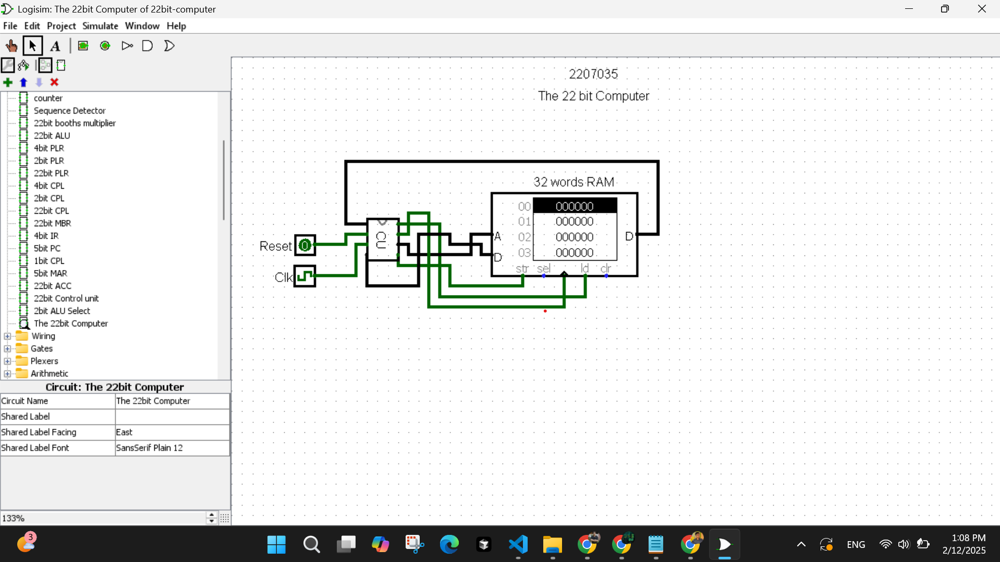

> **Working demonstration:** [https://youtu.be/jj5lmA1aICw](https://youtu.be/jj5lmA1aICw) (39 seconds).

> **Full project report (PDF):** [`Project_report.pdf`](Project_report.pdf), a 10-page report covering the design and implementation.

## What the computer implements

| Property | Implementation |
| --- | --- |
| Word size | 22 bits |
| Memory | 32 words x 22 bits |
| Address width | 5 bits |
| Instruction opcode | 4 bits |
| Main registers | 22-bit accumulator (ACC), 22-bit memory buffer register (MBR), 4-bit instruction register (IR), 5-bit program counter (PC), and 5-bit memory address register (MAR) |
| ALU operations | OR, AND, addition, and subtraction |
| Status flags | Negative, zero, carry, and overflow |
| Control | Hardwired, multi-step fetch/execute control |
| Branching | Unconditional, subroutine, and flag-dependent jumps |
| Additional arithmetic unit | Sequential 22-bit Booth multiplier with a 44-bit product |

The processor uses one RAM for instructions and data. The control unit moves values between the PC, MAR, RAM, MBR, IR, ACC, and ALU through explicit control signals. This made the fetch and execute phases visible at gate level and was one of the most useful parts of the project: every register transfer can be followed directly in the simulator.

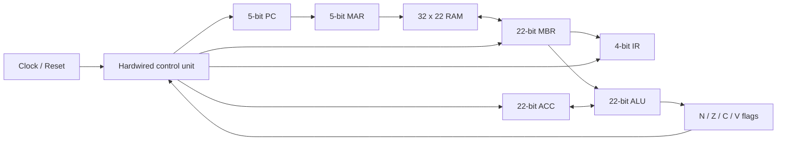

## Datapath design

### Carry-lookahead arithmetic

The arithmetic path is hierarchical. A 4-bit carry-lookahead adder calculates propagate and generate terms so carries do not have to ripple through every bit. A separate 2-bit CLA handles the remaining width. Five 4-bit adder/subtractor blocks plus one 2-bit block produce the full 22-bit result.

| 4-bit CLA | 2-bit CLA |
| --- | --- |
| 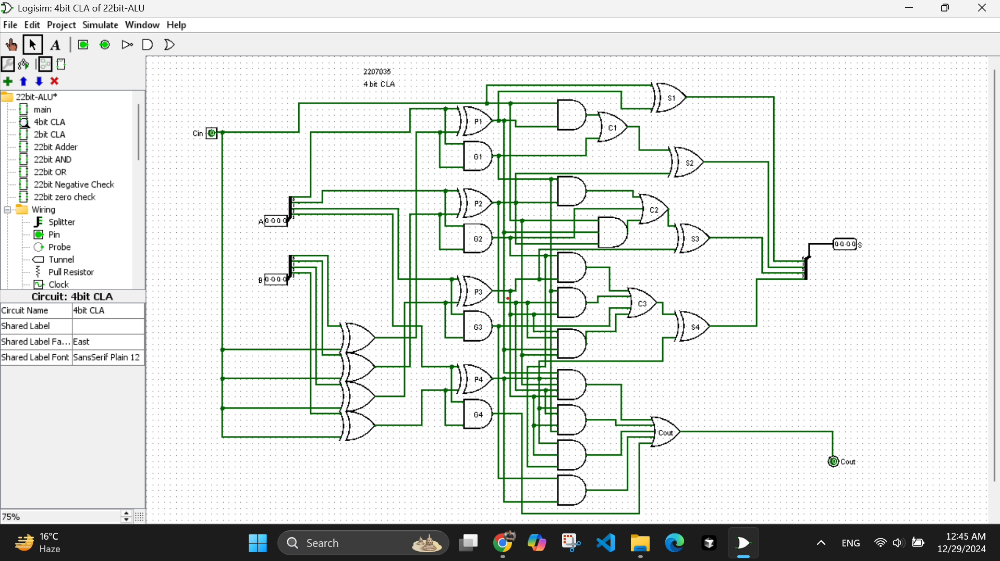 | 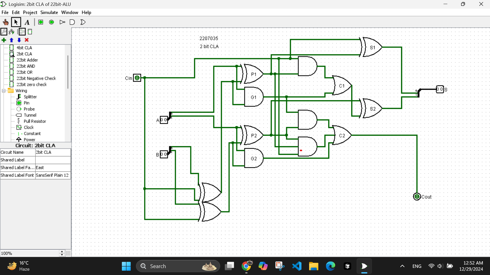 |

The assembled adder supports both addition and two's-complement subtraction. Its control input selects add or subtract, while the extra logic reports carry-out and signed overflow independently.

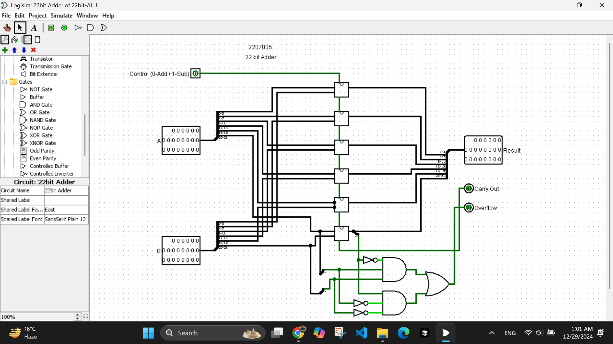

### ALU and flags

The ALU accepts two 22-bit operands and selects one of four results:

| ALU control | Operation |
| --- | --- |
| `00` | OR |
| `01` | AND |
| `10` | Add |
| `11` | Subtract |

Alongside the result, the ALU produces the negative, zero, carry, and overflow conditions. Those four values are captured in a flag register and fed back into the control unit for comparison and conditional branches.

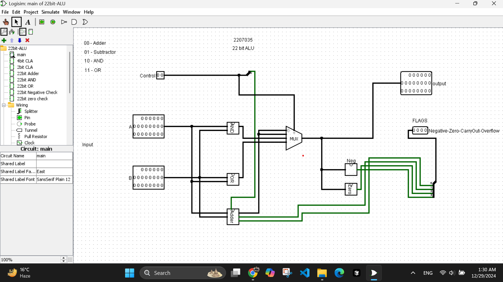

### Booth multiplier

The multiplier is a separate sequential arithmetic circuit built as an extension to the CPU datapath. It applies Booth's signed multiplication algorithm to two 22-bit operands. A sequence detector coordinates load, add/subtract, arithmetic shift, and count operations across 22 cycles; the final 44-bit product is exposed as two 22-bit halves.

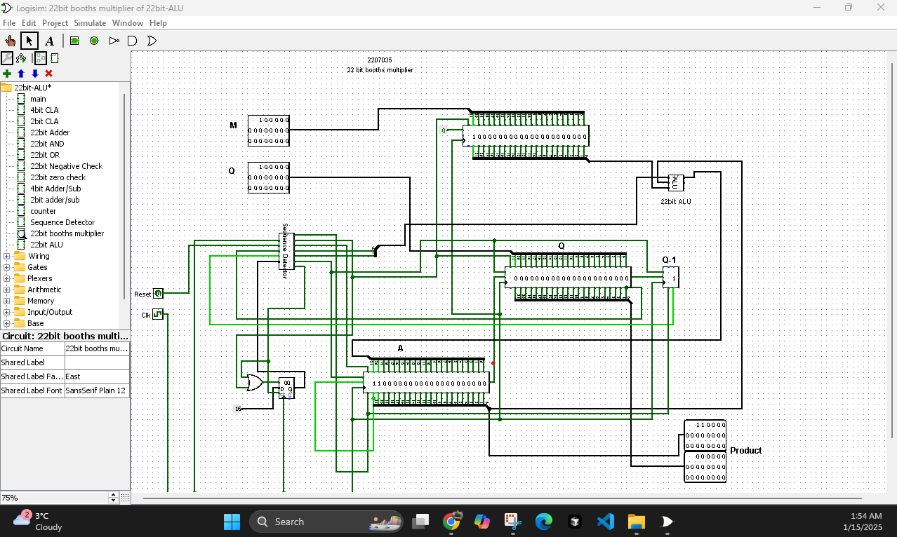

## Registers and memory interface

I used two reusable register families throughout the design:

- **PLR (parallel-load register):** stores an input word when `LOAD` is asserted and supports clock and clear inputs.
- **CPL (count/parallel-load register):** adds a count path to the same storage structure, making it suitable for the PC, MAR, and MBR behavior required by the control logic.

Both families are assembled from 4-bit slices with a final 2-bit slice, which keeps the 22-bit circuits manageable and makes each layer independently testable.

| 22-bit parallel-load register | 22-bit count/parallel-load register |
| --- | --- |
| 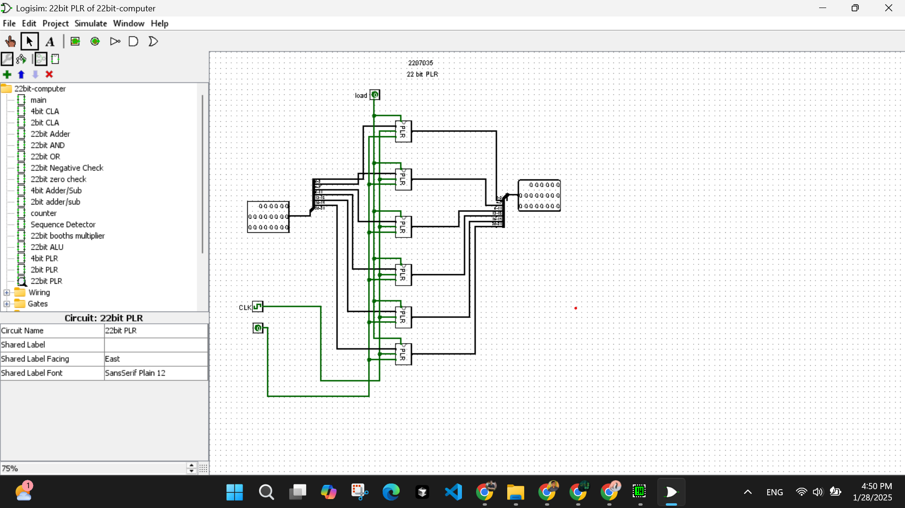 | 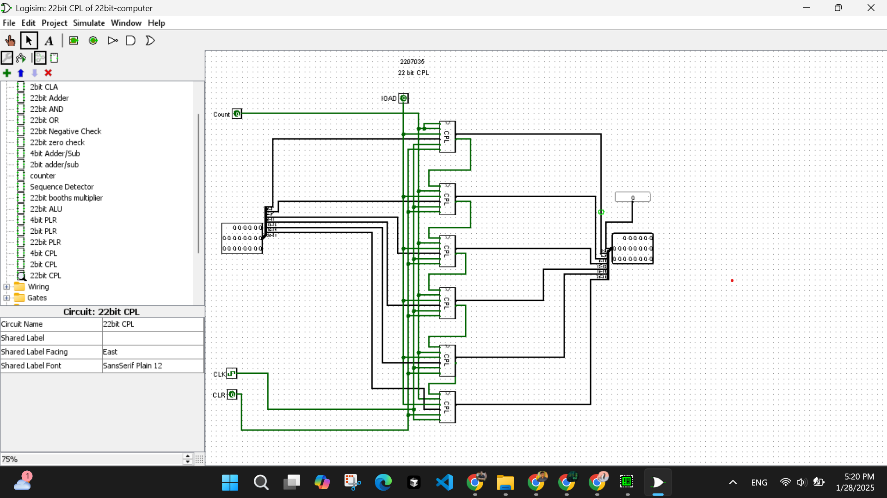 |

The processor-specific registers are then built on top of those blocks:

| Register | Role |
| --- | --- |
| MBR (22-bit) | Buffers instructions and data moving to or from RAM. |
| IR (4-bit) | Holds bits 19-16 of the current instruction for opcode decoding. |
| PC (5-bit) | Holds the next instruction address and supports load, clear, and increment operations. |
| MAR (5-bit) | Drives the RAM address input. |
| ACC (22-bit) | Holds the primary ALU operand and receives arithmetic or loaded data. |

| MBR | IR |
| --- | --- |
| 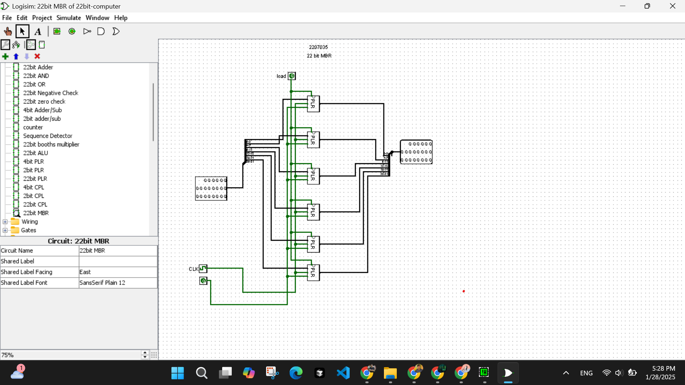 | 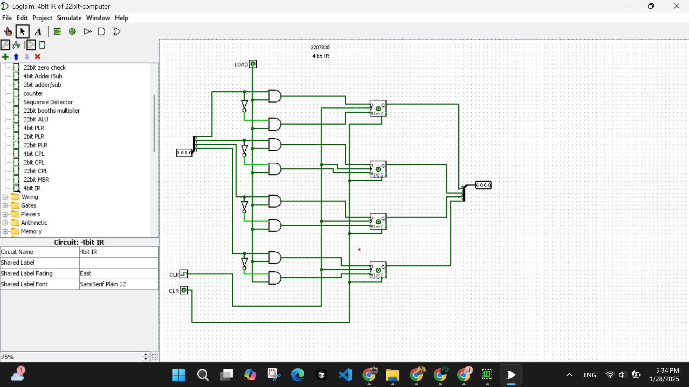 |

| PC | MAR | ACC |
| --- | --- | --- |
| 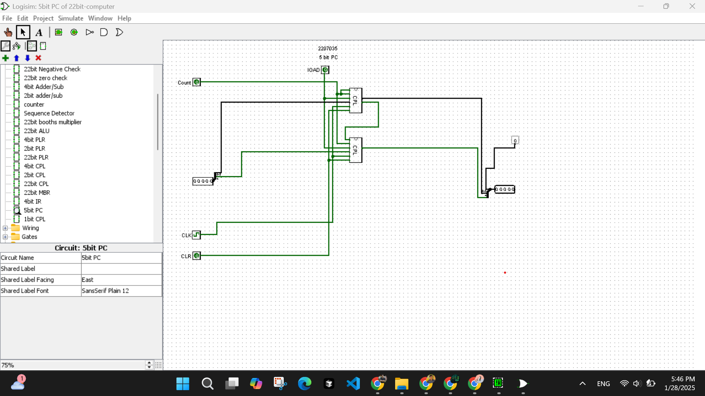 | 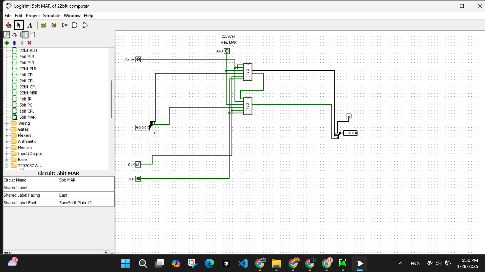 | 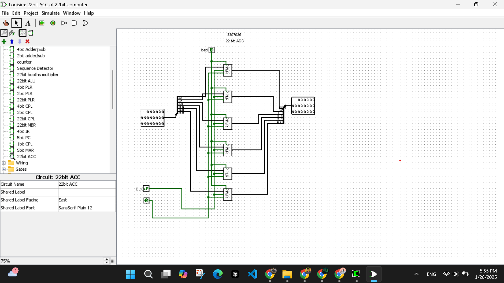 |

## Control unit

The CPU uses hardwired control rather than a microcode ROM. A 4-to-16 decoder turns the IR opcode into one-hot instruction lines. Timing states gate those lines into register-transfer signals such as `PCtoMAR`, `MEMtoMBR`, `MBRtoIR`, `MBRtoACC`, `ACCtoMBR`, and the PC increment/load paths.

The fetch path and execute path share the datapath but assert different transfers at different timing states. HALT gates the outgoing clock, while the zero, negative, carry, and overflow flags qualify their corresponding branch instructions.

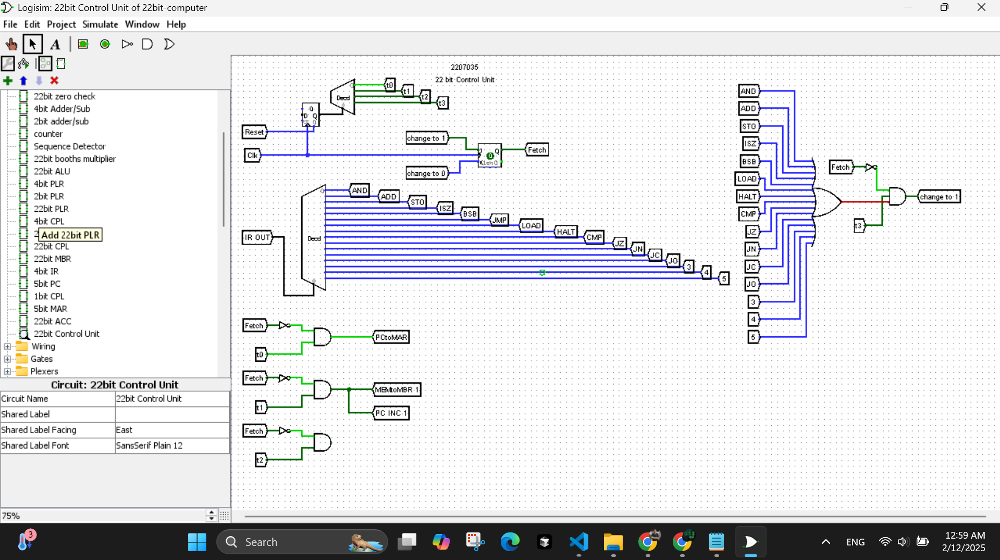

The ALU selector converts the one-hot arithmetic instruction signals into the ALU's two-bit control code.

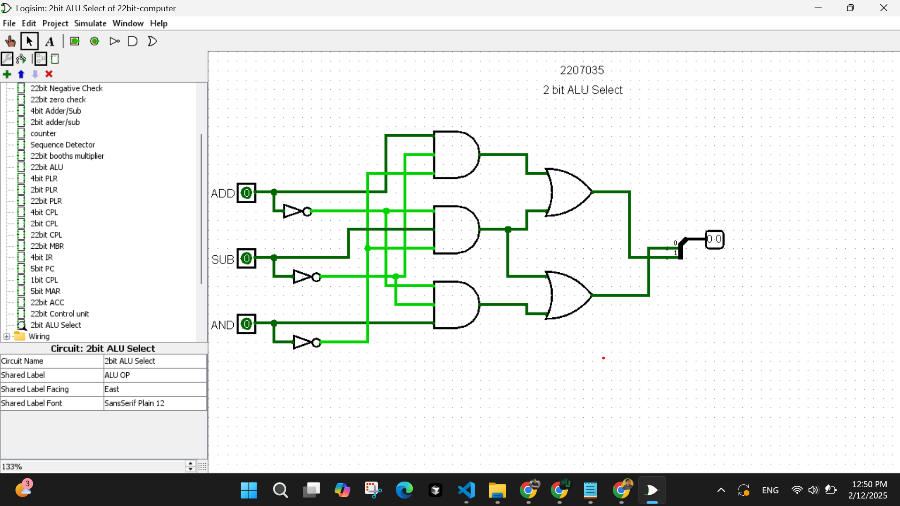

## Instruction format and instruction set

Only the fields needed by this machine are connected in the 22-bit instruction word:

| Bits | Width | Meaning |
| --- | ---: | --- |
| 21-20 | 2 | Reserved |
| 19-16 | 4 | Opcode |
| 15-5 | 11 | Reserved |
| 4-0 | 5 | Memory or branch address |

For example, `060005` means opcode `6` (`LOAD`) with address `05`.

| Opcode | Mnemonic | Operation |
| ---: | --- | --- |
| `0` | `AND` | `ACC <- ACC AND M[address]` |
| `1` | `ADD` | `ACC <- ACC + M[address]` |
| `2` | `STO` | `M[address] <- ACC` |
| `3` | `ISZ` | Increment a memory word and skip the next instruction when the result is zero |
| `4` | `BSB` | Branch-and-save operation for subroutine control flow |
| `5` | `JMP` | Unconditional jump to `address` |
| `6` | `LOAD` | `ACC <- M[address]` |
| `7` | `HALT` | Stop the processor clock |
| `8` | `CMP` | Compare the accumulator with `M[address]` and update flags |
| `9` | `JZ` | Jump when the zero flag is set |
| `A` | `JN` | Jump when the negative flag is set |
| `B` | `JC` | Jump when the carry flag is set |
| `C` | `JO` | Jump when the overflow flag is set |
| `D-F` | Not assigned | Reserved for future instructions |

## Running the project

The circuit was created with **Logisim 2.7.1**. Using the same version is recommended because newer forks may display or migrate older circuit files differently.

### Requirements

- A Java Runtime Environment available through the `java` command
- `logisim-generic-2.7.1.jar`
- A graphical desktop environment because Logisim is a desktop application

You can confirm that Java is available with:

```bash
java -version
```

### Launching Logisim from the command line

Clone the repository and enter its directory:

```bash
git clone https://github.com/khalid999devs/simple_22-bit-computer.git
cd simple_22-bit-computer
```

On macOS or Linux, if the Logisim JAR is in your `Downloads` directory, run:

```bash
java -jar "$HOME/Downloads/logisim-generic-2.7.1.jar" "./22bit-computer.circ"
```

On Windows PowerShell, the equivalent command is:

```powershell
java -jar "$HOME\Downloads\logisim-generic-2.7.1.jar" ".\22bit-computer.circ"
```

The fully portable form is:

```bash
java -jar "/path/to/logisim-generic-2.7.1.jar" "/path/to/22bit-computer.circ"
```

Replace both paths with the locations on your computer. Because Java runs the generic JAR, the same approach works on Windows, macOS, and Linux.

### Loading and executing a program

1. Select **The 22bit Computer** from the circuit tree after Logisim opens.
2. Right-click the **32 words RAM** component and choose **Load Image...**.
3. Select one of the memory images from [`programs/`](programs/).
4. Assert **Reset** once to initialize the processor state.
5. Use **Simulate > Ticks Enabled** for continuous execution, or pulse the clock manually to inspect individual state transitions.

If the command reports that it cannot find Java, install a JRE and ensure `java` is on your `PATH`. If it cannot access the JAR or circuit, verify the two file paths and keep paths containing spaces inside quotes.

The included Logisim memory images cover addition, comparisons, conditional jumps, overflow/carry/negative cases, and subroutine-style branching:

| Program image | Purpose |
| --- | --- |
| [`simple_add.img`](programs/simple_add.img) | Basic load, addition, store, and halt path |
| [`compare_n_jmp.img`](programs/compare_n_jmp.img) | Compare followed by conditional control flow |
| [`negJump.img`](programs/negJump.img) | Negative-flag branch case |
| [`jmp_carry.img`](programs/jmp_carry.img) | Carry-flag branch case |
| [`jmp_overflow.img`](programs/jmp_overflow.img) | Overflow-flag branch case |
| [`branch_subroutine_jmp.img`](programs/branch_subroutine_jmp.img) | Branch/save and jump-based subroutine path |
| [`newImg.img`](programs/newImg.img) | Small smoke-test memory image |

## Repository layout

```text
.
|-- 22bit-computer.circ   # Complete Logisim project
|-- Project_report.pdf    # Full design and implementation report
|-- programs/             # Loadable RAM test programs
|-- screenshots/          # Curated circuit documentation used above
|-- working.mp4           # End-to-end execution recording
|-- LICENSE               # MIT open-source license
`-- README.md
```

## What this project demonstrates

The finished simulation is useful, but the main outcome was understanding how the layers fit together: propagate/generate equations become an adder; storage slices become architectural registers; register transfers become fetch and execute cycles; and status flags become program-level decisions. Building and testing those layers separately made faults traceable and turned the final computer into a system I could reason about signal by signal, not just a circuit that happened to run.

## License

This project is open source under the [MIT License](LICENSE). You may use, study, modify, and redistribute the circuit and its supporting files as long as the original copyright and license notice are retained.
